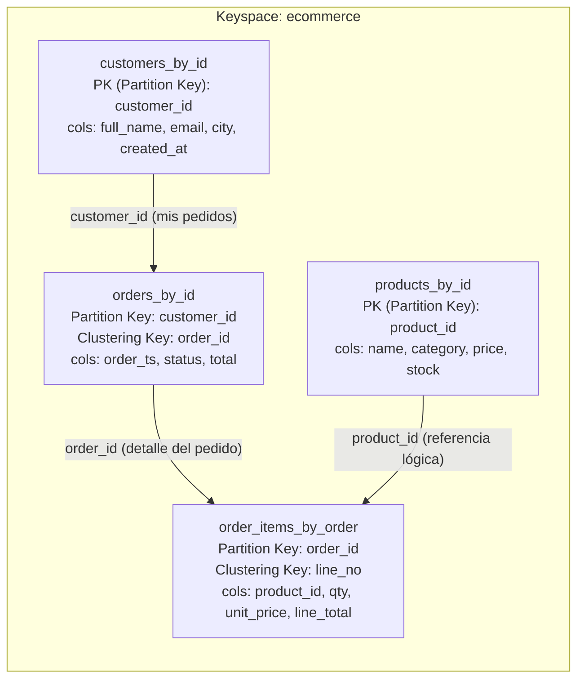
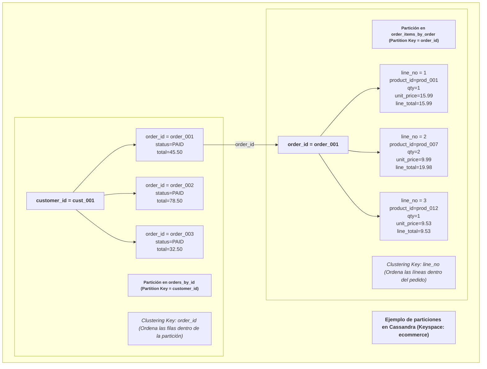

# Guía Didáctica Tema 10 - Clase 1: Cassandra - modelo columnar y consistencia

## 1) Idea clave antes de comenzar

### Cassandra no se diseña “como SQL”

En Cassandra **no modelas “entidades y relaciones”** para luego preguntar cualquier cosa.

En Cassandra **diseñas tablas para responder consultas concretas** (query-based modeling).

### Qué es una partición

En una tabla Cassandra, la **partition key** decide:

* **en qué nodo(s)** vive el dato
* **cómo se agrupan** filas relacionadas
* el rendimiento: Cassandra es rápida cuando consultas **por partición**

Una partición es “el cajón” donde Cassandra guarda juntas filas que comparten la misma _partition key_.

## 2) Por qué tener varios nodos

Con 3 nodos y `replication_factor = 3`:

1. **Alta disponibilidad**: si cae un nodo, el sistema puede seguir atendiendo (según consistencia).
2. **Tolerancia a fallos**: hay copias del dato en varios nodos.
3. **Escalabilidad horizontal**: más nodos → más capacidad (lecturas/escrituras repartidas).
4. **Consistencia configurable (tunable consistency)**: puedes elegir entre rapidez o garantías (`ONE`, `QUORUM`, `ALL`).

## 3) Arranque del entorno

```bash
docker compose up -d
docker compose ps
```

## 4) Verificar clúster (3 nodos)

```bash
docker exec -it cass1 nodetool status
```

Debes ver **3 nodos `UN`**.

## 5) Entrar a Cassandra

```bash
docker exec -it cass1 cqlsh
```

### Parte A — Entender las tablas y sus particiones

El siguiente diagrama, ilustra la base de datos que utilizaremos:

* **Partition Key:** agrupa y decide dónde se guarda el dato (la “partición”).
* **Clustering Key:** ordena filas dentro de esa partición.
* **Las flechas** son relaciones lógicas (Cassandra no aplica foreign keys).



Por otro lado, las particiones son nodos dentro la estructura como muestra la siguiente figure:



Vamos a comenzar utilizando el keyspace:

```sql
USE ecommerce;
```

#### A1) Tabla `products_by_id`

```sql
DESCRIBE TABLE products_by_id;
```

* **Partition key**: `product_id` (porque es la PRIMARY KEY)
* Cada producto es una partición distinta (particiones pequeñas, acceso directo).

✅ Consulta ideal:

```sql
SELECT * FROM products_by_id WHERE product_id='prod_001';
```

**Qué aprenden**: Cassandra vuela cuando preguntas por **PK/partition key**.

#### A2) Tabla `customers_by_id`

```sql
DESCRIBE TABLE customers_by_id;
```

* **Partition key**: `customer_id`
* Igual: acceso directo.

✅ Consulta ideal:

```sql
SELECT * FROM customers_by_id WHERE customer_id='cust_0001';
```

#### A3) Tabla `orders_by_id` (ojo, aquí está la “magia”)

```sql
DESCRIBE TABLE orders_by_id;
```

Estructura (resumen):

* **Partition key**: `customer_id`
* **Clustering key**: `order_id`

**¿Qué significa esto?**

* Cassandra guarda **todos los pedidos de un cliente juntos**, en la misma partición.
* Dentro de esa partición, ordena/organiza por `order_id` (clustering).

✅ Consulta para “ver pedidos de un cliente”:

```sql
SELECT * FROM orders_by_id WHERE customer_id='cust_0001';
```

**Por qué es bueno**:

* Es una consulta típica de e-commerce (“mis pedidos”).
* Se resuelve leyendo **una sola partición**, muy rápido.

**Limitación típica**:

* No es buena para: “dame todos los pedidos del sistema” sin partition key.
* En Cassandra, eso se modela con otra tabla si lo necesitas.

#### A4) Tabla `order_items_by_order`

```sql
DESCRIBE TABLE order_items_by_order;
```

* **Partition key**: `order_id`
* **Clustering key**: `line_no`

✅ Consulta típica “líneas de un pedido”:

```sql
SELECT * FROM order_items_by_order WHERE order_id='order_0001';
```

**Idea clave**: si tu pantalla/endpoint necesita “ver detalle del pedido”, esta tabla está hecha exactamente para esa consulta.

### Parte B — Verificar datos (los ~1000 registros)

```sql
SELECT count(*) FROM products_by_id;
SELECT count(*) FROM customers_by_id;
SELECT count(*) FROM orders_by_id;
SELECT count(*) FROM order_items_by_order;
```

Esperado: **300 + 200 + 200 + 300 = 1000**

### Parte C — Operaciones básicas (CRUD)

#### C1) Insertar un producto

```sql
INSERT INTO products_by_id (product_id,name,category,price,stock)
VALUES ('prod_demo','Demo Product','electronics',99.99,20);

SELECT * FROM products_by_id WHERE product_id='prod_demo';
```

#### C2) Actualizar stock

```sql
UPDATE products_by_id SET stock = 15 WHERE product_id='prod_demo';
SELECT product_id,stock FROM products_by_id WHERE product_id='prod_demo';
```

#### C3) Borrar

```sql
DELETE FROM products_by_id WHERE product_id='prod_demo';
```
