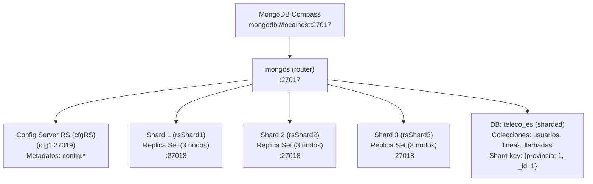

# Guía didáctica Tema 7 - Clase 2: Replica Sets y Sharding en MongoDB

Este laboratorio está diseñado para ejecutarse **casi por completo de forma visual en MongoDB Compass**, usando filtros, proyecciones, ordenaciones y el constructor de agregaciones. Cuando se necesiten comandos de administración (por ejemplo, listar shards), se harán desde **MongoDB Shell**, que sigue siendo “dentro de Compass”.

Para este laboratorio se ha generado de manera automática una base de datos que simula la actividad de llamadas telefónicas de un proveedor de telefonía. La estructura que se genera es la que se muestra en la siguiente figura:



## Objetivos

Al finalizar, el alumno será capaz de:

* Diferenciar **Replica Set** (alta disponibilidad) y **Sharding** (escalado horizontal).
* Identificar el rol de **mongos** como router.
* Reconocer el impacto de la **shard key** en consultas:
  * consultas dirigidas (con shard key),
  * consultas scatter-gather (sin shard key).
* Construir agregaciones visuales para analítica básica (top usuarios, usuarios con múltiples líneas, llamadas recientes).
* Validar la **distribución** de datos observando `config.shards`, `config.collections` y `config.chunks`.

## Requisitos y arranque del entorno

### Arranque recomendado (si se necesita reiniciar)

En la raíz del proyecto:

```bash
docker compose down -v
docker compose up -d
docker logs -f setup
```

### Conexión desde Compass

En Compass → **New Connection**:

* URI: `mongodb://localhost:27017`

Conectar.

## Confirmación inicial en Compass

### Ver bases de datos y colecciones

En la barra izquierda deben aparecer:

* `teleco_es`

  * `usuarios`
  * `lineas`
  * `llamadas`

**Qué deben observar**

* Que hay datos (no colecciones vacías).
* Que la conexión está hecha contra `mongos`.

## Sharding: validación visual

### Ver shards registrados de forma visual (DB `config`)

En Compass:

1. Abrir la base de datos **config**
2. Abrir la colección **shards**
3. Pestaña **Documents**

**Qué deben observar**

* Documentos con `_id` similares a: `rsShard1`, `rsShard2`, `rsShard3`.
* Un campo tipo `host` con el connection string del RS.

## Consultas “Find” 100% visuales (Documents)

Objetivo: comparar consultas con shard key vs sin shard key.

### Consulta dirigida (incluye shard key)

Colección: `teleco_es.usuarios` → pestaña **Documents**

* **Filter**

```json
{ "provincia": "MADRID" }
```

* **Project**

```json
{ "nombre": 1, "provincia": 1, "email": 1 }
```

* **Sort**

```json
{ "_id": -1 }
```

* **Limit**
  `10`

Pulsar **Find**.

**Qué deben observar**

* Resultados inmediatos y filtrados por provincia.
* Esta consulta es “amiga del sharding” porque usa `provincia`.

### Consulta potencialmente scatter-gather (no incluye shard key)

Colección: `teleco_es.usuarios` → **Documents**

* **Filter**

```json
{ "estado": "ACTIVO" }
```

* **Project**

```json
{ "nombre": 1, "provincia": 1, "estado": 1 }
```

* **Limit**
  `10`

Pulsar **Find**.

**Qué deben observar**

* Resultados, pero la consulta no “dirige” por shard key.
* Se usa para explicar que `mongos` podría consultar más shards.

### Comparar rendimiento con Explain (visual)

En Compass, tras ejecutar cada Find:

* Abrir **Explain Plan** (botón/pestaña según versión).

**Qué deben observar**

* En la consulta con shard key, el plan debería reflejar una ejecución más “dirigida”.
* En la consulta sin shard key, es habitual ver una ejecución que involucra más trabajo global.

## Agregaciones 100% visuales (Aggregations)

### Top 10 usuarios por volumen de llamadas en una provincia (con `$lookup` para hacerlo más visual)

Colección: `teleco_es.llamadas` → pestaña **Aggregations**

Añadir stages (botón **Add Stage**):

#### Stage 1 — `$match`

```json
{ "provincia": "BARCELONA" }
```

#### Stage 2 — `$group`

```json
{
  "_id": "$usuarioId",
  "totalLlamadas": { "$sum": 1 }
}
```

#### Stage 3 — `$sort`

```json
{ "totalLlamadas": -1 }
```

#### Stage 4 — `$limit`

```json
10
```

Hasta aquí ya hay un ranking. Para “humanizar” la salida:

#### Stage 5 — `$lookup` (traer datos del usuario)

```json
{
  "from": "usuarios",
  "localField": "_id",
  "foreignField": "_id",
  "as": "usuario"
}
```

#### Stage 6 — `$unwind`

```json
"$usuario"
```

#### Stage 7 — `$project`

```json
{
  "_id": 0,
  "usuarioId": "$_id",
  "nombre": "$usuario.nombre",
  "provincia": "$usuario.provincia",
  "totalLlamadas": 1
}
```

Pulsar **Run**.

**Qué deben observar**

* Un “Top 10” con nombre y provincia, comprensible para negocio.
* Se refuerza el modelo: llamadas referencian a usuario (`usuarioId`).

### Usuarios con múltiples líneas (>= 2)

Colección: `teleco_es.lineas` → **Aggregations**

#### Stage 1 — `$group`

```json
{
  "_id": "$usuarioId",
  "nLineas": { "$sum": 1 },
  "provincia": { "$first": "$provincia" }
}
```

#### Stage 2 — `$match`

```json
{ "nLineas": { "$gte": 2 } }
```

#### Stage 3 — `$sort`

```json
{ "nLineas": -1 }
```

#### Stage 4 — `$limit`

```json
20
```

**Qué deben observar**

* Usuarios con varias líneas (concepto típico de telco: multi-SIM / líneas familiares).

### Últimas 20 llamadas en una provincia (opción Find o Aggregation)

Colección: `teleco_es.llamadas`

**Opción A — Documents (Find visual)**

* **Filter**

```json
{ "provincia": "VALENCIA" }
```

* **Sort**

```json
{ "inicio": -1 }
```

* **Limit**: `20`

**Opción B — Aggregations**

#### Stage 1 — `$match`

```json
{ "provincia": "VALENCIA" }
```

#### Stage 2 — `$sort`

```json
{ "inicio": -1 }
```

#### Stage 3 — `$limit`

```json
20
```

**Qué deben observar**

* Ejemplo de consulta operativa típica: “últimos eventos por región”.

## Conclusiones

* **Replica Sets**: garantizan continuidad del servicio ante fallos (failover).
* **Sharding**: permite distribuir la carga y el almacenamiento.
* La **shard key** decide si las consultas son eficientes o “disparan a todos”.
* `mongos` enruta; los datos viven en los shards.
* Los metadatos del clúster viven en la base `config`.
